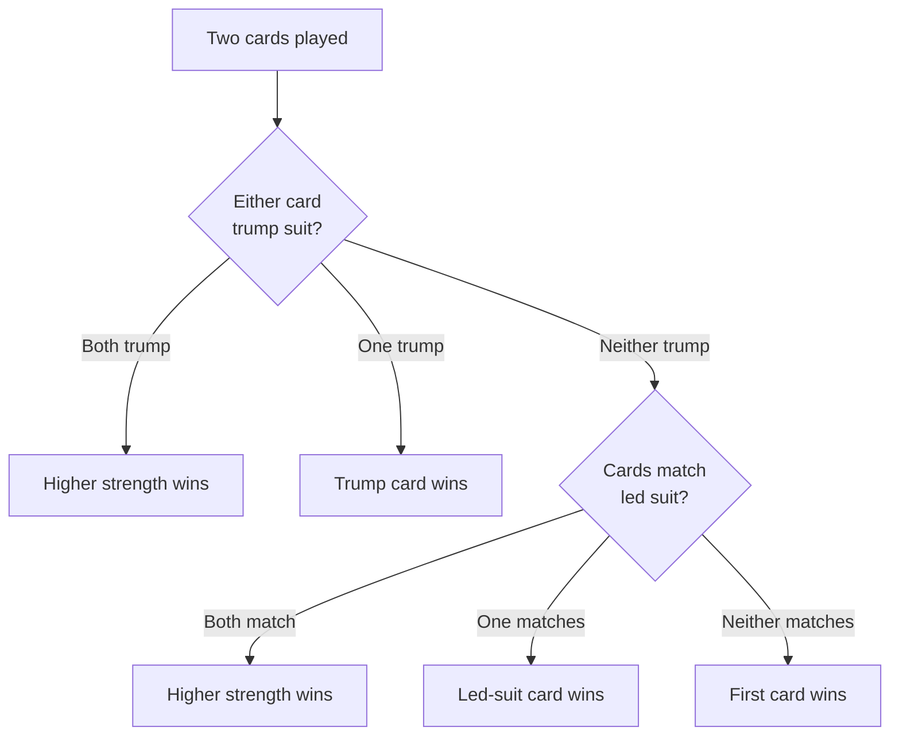
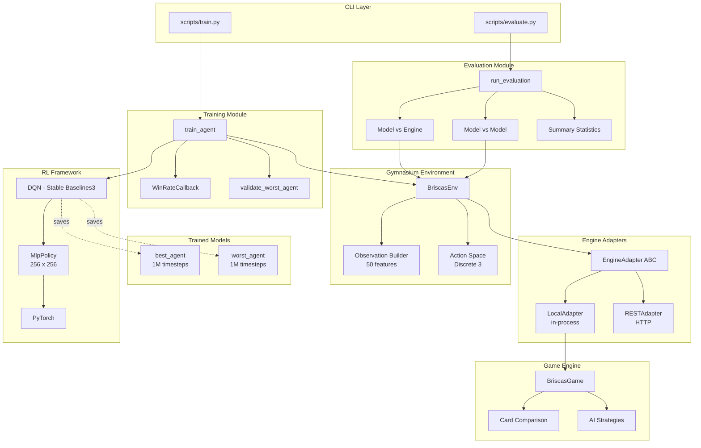
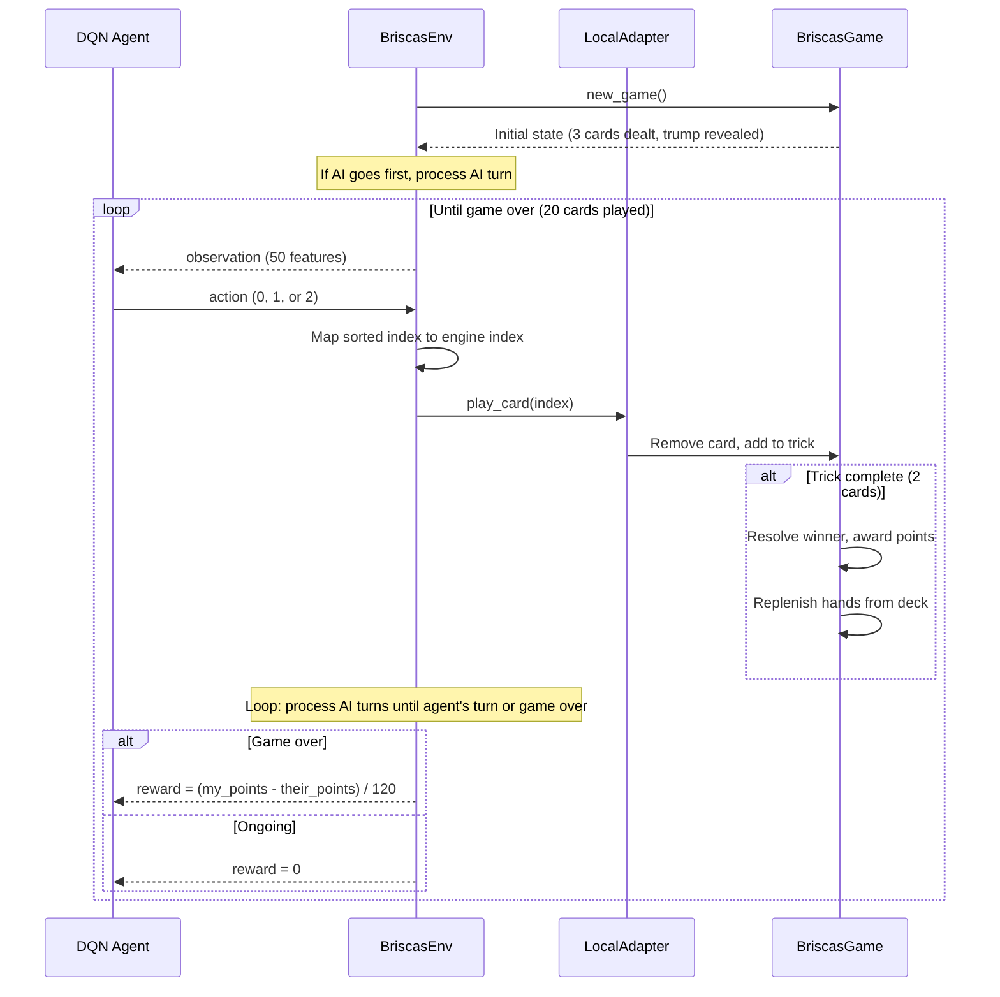
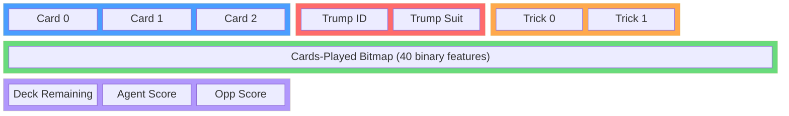
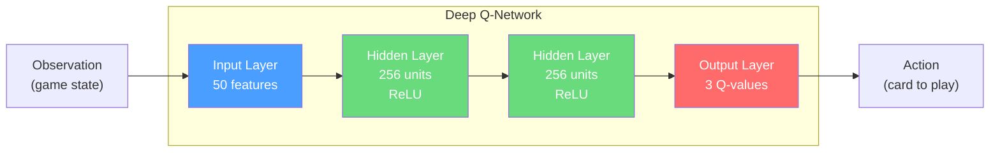
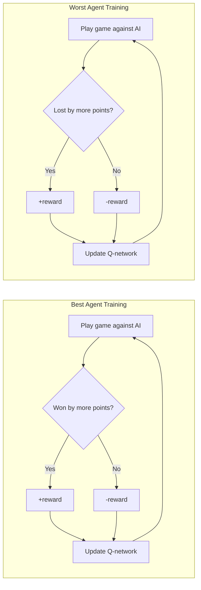
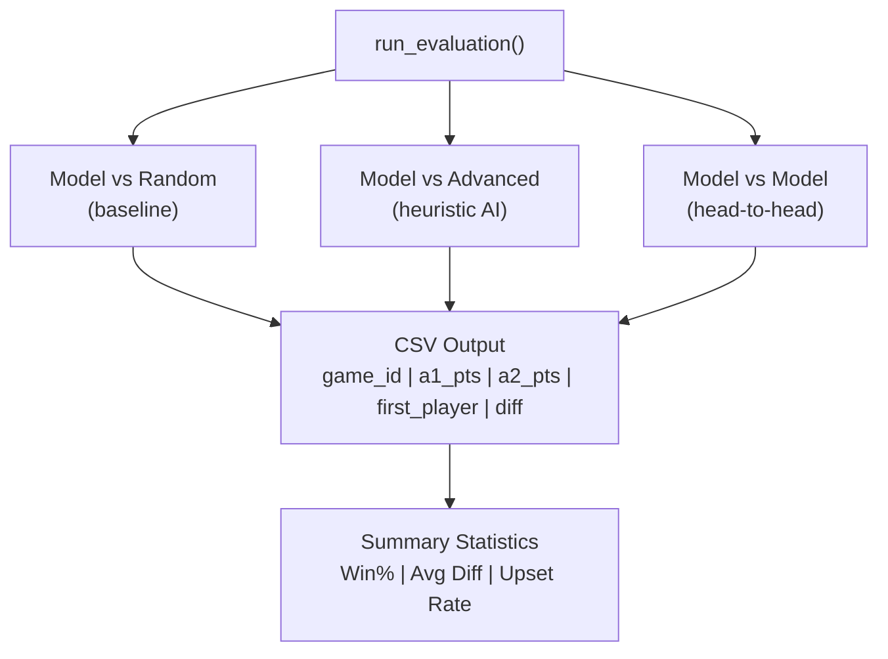

# Briscas RL

**Teaching a neural network to master (and deliberately lose) the classic Spanish card game Brisca using Deep Reinforcement Learning.**

Train DQN agents that learn optimal and anti-optimal play strategies for Brisca (Briscas), a traditional trick-taking card game played with the 40-card Spanish deck. The project includes a full in-process game engine, a Gymnasium-compatible environment, training and evaluation pipelines, and pre-trained models.

---

## Table of Contents

- [The Game](#the-game)
- [Architecture](#architecture)
- [How It Works](#how-it-works)
- [Observation & Action Spaces](#observation--action-spaces)
- [Training Pipeline](#training-pipeline)
- [Evaluation System](#evaluation-system)
- [Results](#results)
- [Quickstart](#quickstart)
- [Project Structure](#project-structure)

---

## The Game

Brisca is a Spanish trick-taking card game where **points matter, not tricks**. Two players each hold 3 cards, play one per trick, and draw replacements until the deck runs out. There is **no obligation to follow suit**, making every play a strategic choice.

### The Spanish Deck (40 Cards)

```
    Oros (Coins)     Copas (Cups)     Espadas (Swords)     Bastos (Clubs)
     1  2  3          1  2  3          1  2  3               1  2  3
     4  5  6          4  5  6          4  5  6               4  5  6
     7 10 11          7 10 11          7 10 11               7 10 11
    12                12               12                    12
```

> Ranks 8 and 9 are excluded from the Spanish deck.

### Card Values & Strength

| Rank | Name     | Points | Strength |
|------|----------|--------|----------|
| 1    | As       | **11** | 8 (strongest) |
| 3    | Tres     | **10** | 7 |
| 12   | Rey      | **4**  | 6 |
| 11   | Caballo  | **3**  | 5 |
| 10   | Sota     | **2**  | 4 |
| 7    | Siete    | 0      | 3 |
| 6    | Seis     | 0      | 2 |
| 5    | Cinco    | 0      | 1 |
| 4    | Cuatro   | 0      | 0 |
| 2    | Dos      | 0      | -1 (weakest) |

**Total points in deck: 120** (30 per suit). The player with more points at the end wins.

### Trick Resolution



---

## Architecture



---

## How It Works

### Game Loop (Training Episode)



### Reward Design

The agent receives reward **only at the end of each game** -- a normalized point differential:

```
reward = reward_scale * (agent_points - opponent_points) / 120
```

| Agent Type | `reward_scale` | Goal |
|------------|----------------|------|
| **Best**   | +1.0           | Maximize point differential (learn to win) |
| **Worst**  | -1.0           | Minimize point differential (learn to lose) |

This creates two complementary agents: one that plays optimally and one that plays anti-optimally -- useful for analyzing the full spectrum of strategic play.

---

## Observation & Action Spaces

### Observation Vector (50 features)



| Index | Feature | Range | Description |
|-------|---------|-------|-------------|
| 0-2 | Hand cards | -1 to 39 | Sorted card IDs, padded with -1 |
| 3 | Trump card ID | 0-39 | The trump card identity |
| 4 | Trump suit | 0-3 | Suit index (Oros/Copas/Espadas/Bastos) |
| 5-6 | Trick cards | -1 to 39 | Cards in current trick |
| 7-46 | Cards-played bitmap | 0 or 1 | Which of 40 cards have been played |
| 47 | Deck remaining | 0-34 | Cards left in draw pile |
| 48 | Agent score | 0-120 | Agent's accumulated points |
| 49 | Opponent score | 0-120 | Opponent's accumulated points |

### Card Encoding

Each of the 40 cards maps to a unique integer ID:

```
card_id = suit_index * 10 + rank_index

Suit indices:  Oros=0  Copas=1  Espadas=2  Bastos=3
Rank indices:  1->0  2->1  3->2  4->3  5->4  6->5  7->6  10->7  11->8  12->9
```

### Action Space

**Discrete(3)** -- the agent picks which card to play from its sorted hand (max 3 cards). Actions exceeding the hand size are masked via modulo.

---

## Training Pipeline

### Neural Network



### Training Configuration

| Parameter | Value |
|-----------|-------|
| Algorithm | DQN (Stable Baselines3) |
| Policy | MlpPolicy |
| Hidden layers | [256, 256] |
| Learning starts | 1,000 timesteps |
| Replay buffer | 100,000 transitions |
| Exploration | Epsilon-greedy with decay |
| Checkpoint frequency | Every 10,000 timesteps |
| Default timesteps | 200,000 |
| Seed | 42 |
| Opponent | Advanced heuristic AI |

### Best vs Worst Agent Training



The **worst agent** undergoes a 1,000-game validation after training to confirm its win rate stays below 45% -- verifying it has genuinely learned anti-optimal play rather than just being a bad learner.

---

## Evaluation System

The evaluation module supports three matchup types:



Each evaluation run produces:
- **CSV file** with per-game results (points, who went first, point differential)
- **Summary statistics** printed to stdout (win rates, avg differential, std dev, upset rate)

---

## Results

### Pre-trained Models (1M timesteps each)

#### Best Agent vs Random (10,000 games)

```
+-------------------------------+
|  Best Agent:  81.6% win rate  |
|  Random:      17.1% win rate  |
|  Draws:        1.2%           |
|  Avg Diff:    +34.2 pts       |
+-------------------------------+
```

#### Worst Agent vs Random (10,000 games)

```
+-------------------------------+
|  Worst Agent: 20.2% win rate  |
|  Random:      78.7% win rate  |
|  Draws:        1.1%           |
|  Avg Diff:    -34.9 pts       |
+-------------------------------+
```

#### Best Agent vs Worst Agent (10,000 games)

```
+-------------------------------+
|  Best Agent:  93.4% win rate  |
|  Worst Agent:  6.1% win rate  |
|  Draws:        0.6%           |
|  Avg Diff:    +56.5 pts       |
+-------------------------------+
```

### Performance Spectrum

```
Worst Agent        Random         Best Agent
    |                 |                |
    20.2%            ~50%            81.6%
    <----  anti-optimal   optimal  ---->

    Best vs Worst: 93.4% win rate, +56.5 avg point differential
```

The worst agent validates at an 8.6% win rate against the advanced heuristic -- confirming it has genuinely learned to lose, not just play randomly.

---

## Quickstart

### Installation

```bash
pip install -r requirements.txt
```

**Requirements:** Python 3.10+, PyTorch 2.3+, Stable Baselines3 2.7+, Gymnasium 1.2+

### Train an Agent

```bash
# Train the best agent (200k timesteps)
python scripts/train.py --agent best --timesteps 200000

# Train the worst agent (500k timesteps, custom seed)
python scripts/train.py --agent worst --timesteps 500000 --seed 123

# Resume training from a checkpoint
python scripts/train.py --agent best --timesteps 1000000 --resume-from models/best_agent_200k
```

### Evaluate Agents

```bash
# Model vs random baseline (10k games)
python scripts/evaluate.py --agent1 models/best_agent_1000k --agent2 random --games 10000

# Model vs advanced heuristic
python scripts/evaluate.py --agent1 models/best_agent_1000k --agent2 advanced

# Model vs model head-to-head
python scripts/evaluate.py --agent1 models/best_agent_1000k --agent2 models/worst_agent_1000k --games 10000
```

### Run Tests

```bash
pytest
```

---

## Project Structure

```
briscas_rl/
├── scripts/
│   ├── train.py              # CLI: train DQN agents
│   └── evaluate.py           # CLI: run evaluation matchups
│
├── gym_env/
│   ├── briscas_env.py         # Gymnasium environment wrapper
│   ├── observation.py         # 50-feature observation builder & card encoding
│   ├── engine_adapter.py      # EngineAdapter ABC, RESTAdapter, dataclasses
│   └── local_adapter.py       # In-process game engine & LocalAdapter
│
├── training/
│   └── train.py               # DQN training, WinRateCallback, validation
│
├── evaluation/
│   └── evaluate.py            # Matchup evaluation, CSV output, statistics
│
├── seed.py                    # Reproducible seeding (random, numpy, torch)
│
├── models/                    # Saved models & metadata
│   ├── best_agent_1000k.zip
│   ├── best_agent_1000k.json
│   ├── worst_agent_1000k.zip
│   ├── worst_agent_1000k.json
│   └── checkpoints/
│
├── results/                   # Evaluation CSV outputs
│   ├── best_agent_1000k_vs_random_10000g_42s.csv
│   ├── worst_agent_1000k_vs_random_10000g_42s.csv
│   └── best_agent_1000k_vs_worst_agent_1000k_10000g_42s.csv
│
├── tests/                     # pytest suite (150+ test cases)
│
├── lets-play-brisca/          # Original Flask-based game engine
│
└── requirements.txt
```
